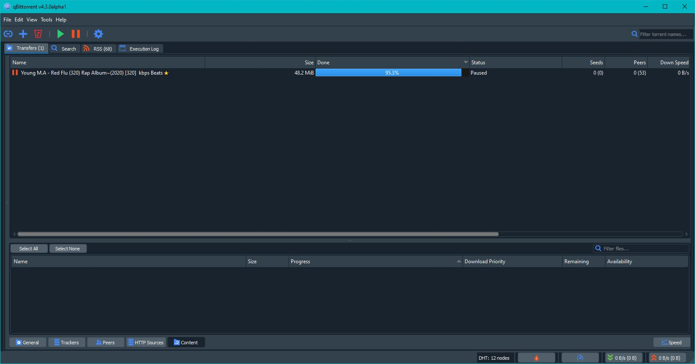
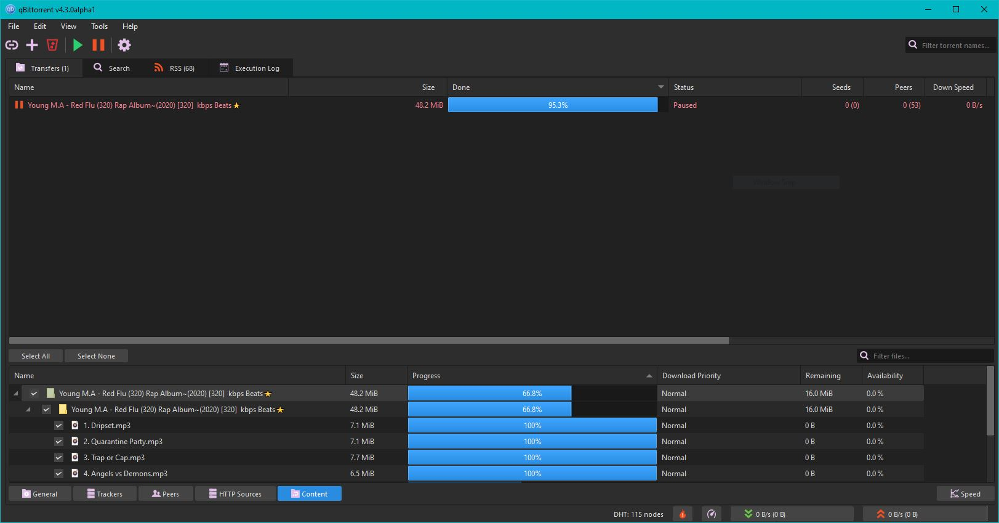
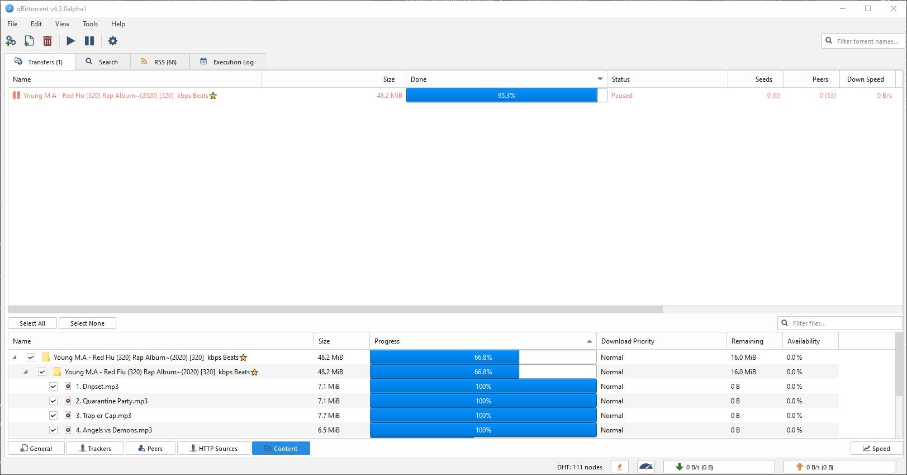
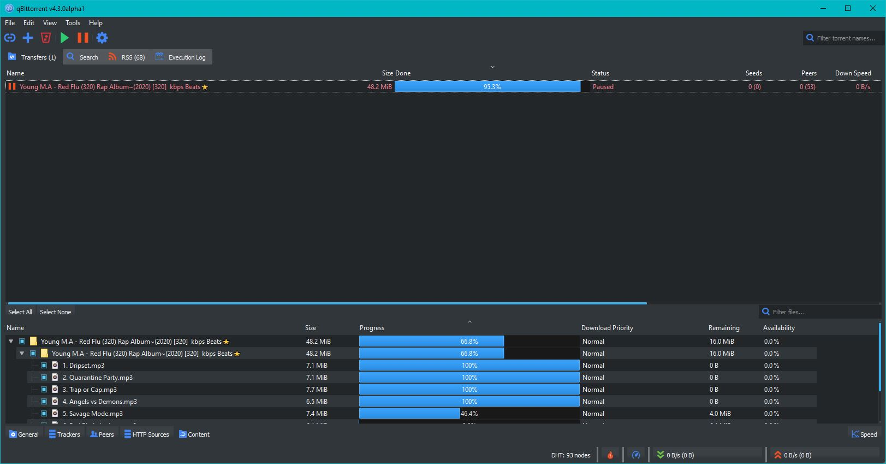

# How to use

1. Download the `.qbtheme` file of your taste. We recommend you download it in a **qBittorrent Themes** folder, but it is not mandatory.
2. Open **qBittorrent**, then go to *Tools -> Options* and click on the box next to *Use custom UI Theme*.
3. Right below that, browse to the path where you previously downloaded the `.qbtheme` file. Click **Apply** and then **OK**.
4. Restart **qBittorrent**. (Close it and then open it again).

# Screenshots
## Darkstylesheet.qbtheme

## Mumble-Dark.qbtheme

## Mumble-Lite.qbtheme

## Breeze-Dark.qbtheme

This repo contains different stylesheed edited to run with qbittorrent's style system  
DarkStyleSheet theme is based on https://github.com/ColinDuquesnoy/QDarkStyleSheet  
Mumble themes are based on https://github.com/mumble-voip/mumble-theme  
Breeze themes are based on https://github.com/Alexhuszagh/BreezeStyleSheets  
Icons used in dark themes are from nowshed-imran. They are meant to be icons for next qbittorrent major release (https://github.com/qbittorrent/qBittorrent/pull/12965). Do give your opinions on the thread :)

## How to create your own theme file?
This repo also contains different tool to create your own qbittorrent theme files.
You can check the source of above style in `Builds` folder
